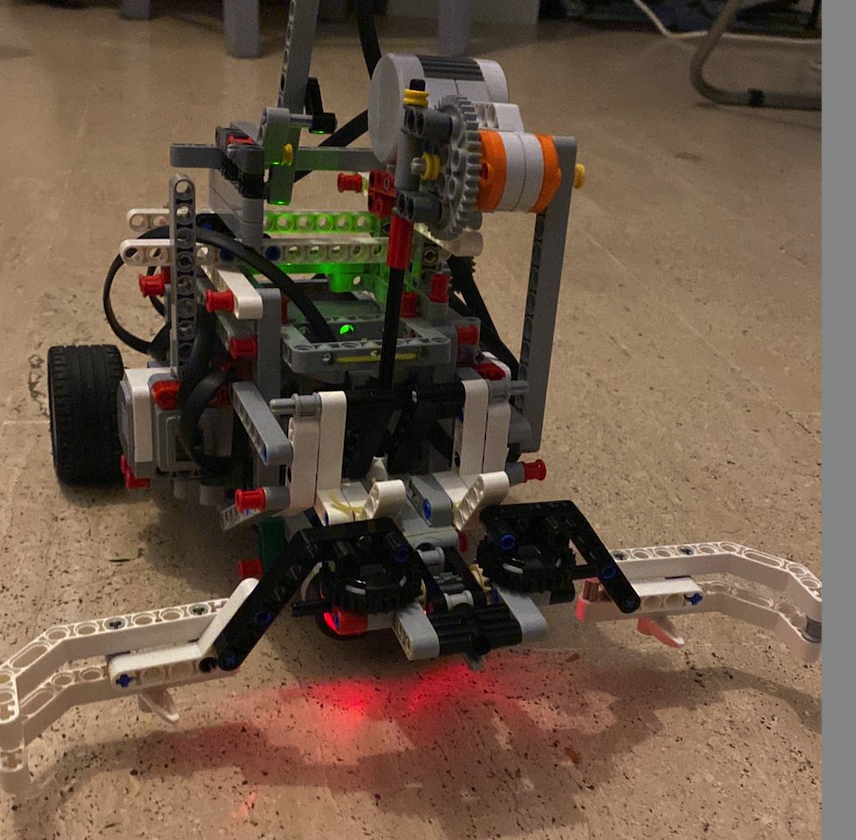
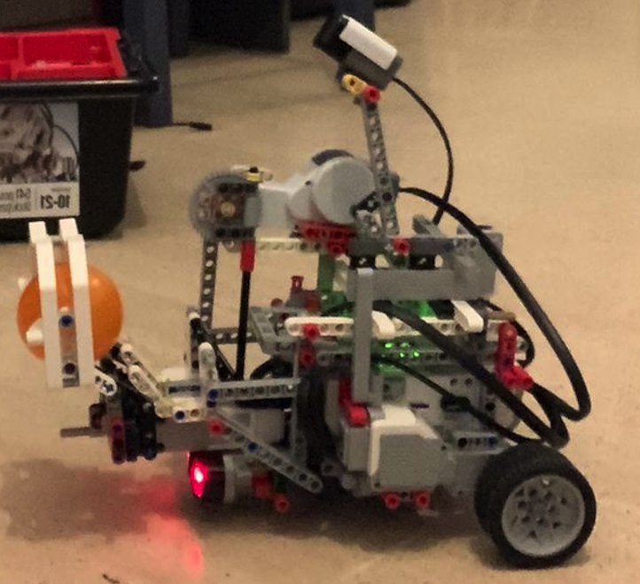

## Operating system robot challenge 2023

This Robot is designed to play basket ball in Operating System Rotot competition held at Eurecom Sophia antipolis on Feb 06 2023

### For installing and setup EV3

Follow the steps from [http://www.ev3dev.org/docs/getting-started/](http://www.ev3dev.org/docs/getting-started/) to download the ev3dev kernel image and flash it on the SD card.

### Folders: 

PSEUDO CODE: Strategy followed:
SOURCE CODE: Code for attacking and defending

### Rotot Front View

### RObot Side View
